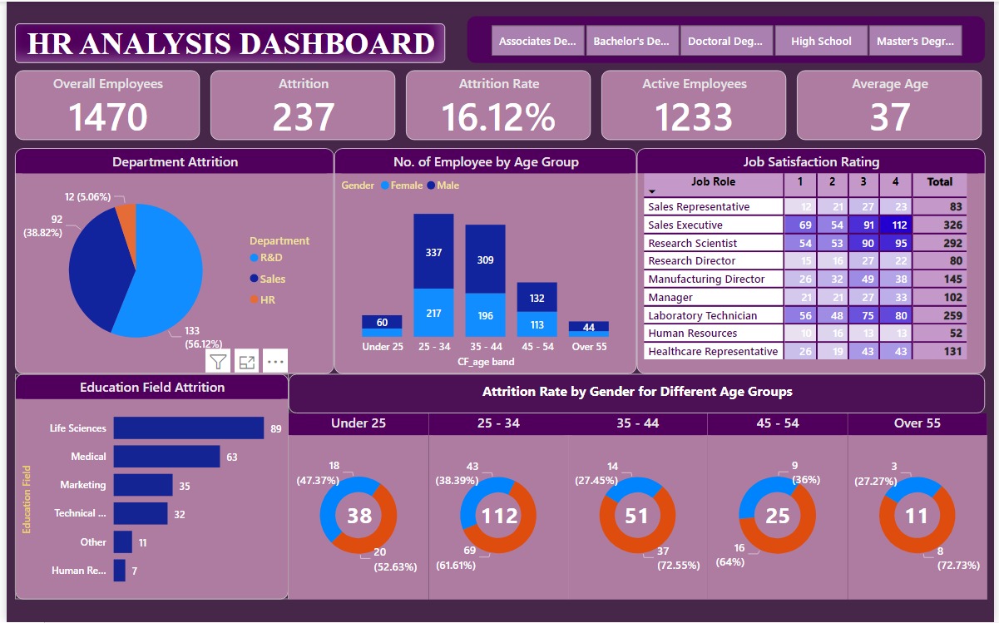

# HR Analysis

---
### Project Overview
This project focused on understanding the dynamics of both overall and active employees exploring job satisfaction and coming up with strategic solutions to reduce attrition rates.

### Data Sources
HR Data: The primary dataset used for this analysis is the "HR Data.xlsx" file, containing detailed information pertinent to attrition within an organization.

### Data used and Tools
- Data - HR Data with over 1470 rows
- Excel & PostgreSQL- Data Cleaning & Analysis
- PowerBI - Visualization

### Here are some key insights, from the project;
 We analyzed a group of 1,470 employees across departments. Out of those we found that 1,233 were actively working and we assessed their satisfaction ratings.
 Interestingly the sales executive role had the job satisfaction rating at 326. This suggests that our workforce in that role is content.
 Our attrition analysis revealed an attrition rate of 16.12% with 237 cases being voluntary. Understanding these numbers is crucial for maintaining stability.

### Based on these findings we have some recommendations for improvement;
1. Enhancing job satisfaction; Our goal is to improve job satisfaction ratings in all departments to reach 90%. We will focus on addressing any issues highlighted in the satisfaction survey and ensuring employees happiness and dedication.
2. Retention initiatives; We will implement tailored career development pathways to foster engagement initiatives aimed at creating an satisfied workplace.
3. Attrition analysis; By identifying trends and vulnerable employee groups as influential factors like education level, department distribution, age groups, etc. we can pinpoint areas where intervention would be most effective, in reducing attrition rates.

**_Overall this project has provided us with insights that will help us improve employee satisfaction and retention within our organization. 
This endeavor goes beyond number analysis. It serves as a guide, to creating a work setting that fosters employee happiness and cultivates an harmonious culture_**.

### You can interact with the report [here](https://www.novypro.com/project/hr-dashboard-76)
